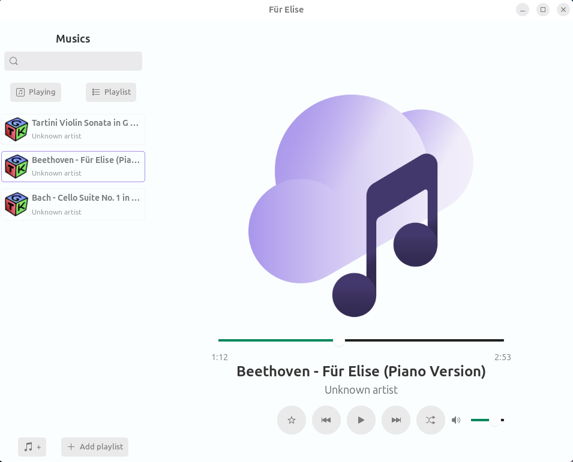
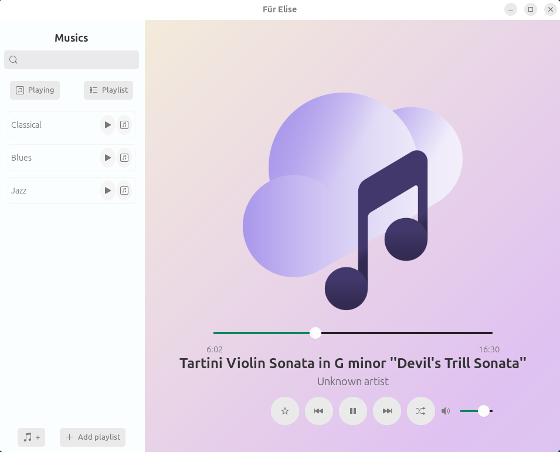
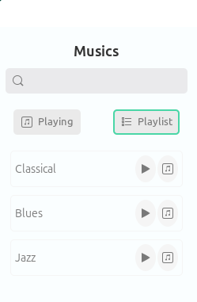

# 🎶 Für Elise Player - Alpha v.01

A modern and minimalistic **GTK4 music player**.  
It allows you to **play songs** and **manage playlists** in a simple and elegant way.

---

## ✨ Features

- ▶️ **Play songs**: supports local audio files.  
- 🎼 **Playlist management**: create, save, and organize your favorite playlists.  
- 🎨 **Styled interface**: built with **GTK4 + CSS**, lightweight and responsive.  
- 🖱️ **Intuitive interaction**: click, select, and easily navigate between playlists.  

---

## 🖼️ Screenshots

### Start Screen

### Player in Action with playlists

### Playlist Management

---

## 🚀 How to Run

1. Compile the project:

    ./buildv2.sh and run the executable.

   make sure you have GTK4 and its dependencies installed.
 